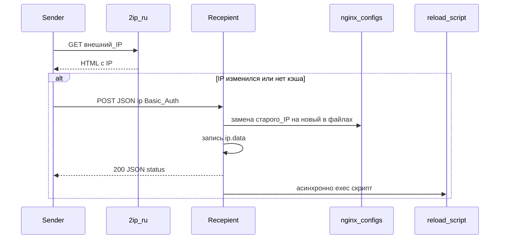

# swapip

Утилиты для **динамического DNS на минималках**: когда у клиента меняется внешний IP, на сервере с nginx автоматически подставляется новый адрес в конфиги и перезапускается веб-сервер.

## Назначение сервисов

| Компонент | Бинарник | Роль |
|-----------|----------|------|
| **Sender** | `cmd/sender` | Запускается там, где «плавает» IP (домашний ПК, роутер с cron и т.д.). Узнаёт текущий внешний IPv4 через сервис [2ip.ru](https://2ip.ru), сравнивает с последним сохранённым значением в локальном файле. Если IP изменился — отправляет его на удалённый HTTP-эндпоинт получателя. |
| **Recepient** | `cmd/recepient` | Работает на сервере с nginx. Поднимает защищённый Basic Auth HTTP-сервер, принимает POST с новым IP, **подменяет старый IP на новый** в указанных файлах конфигурации nginx, сохраняет IP в файл и **запускает скрипт** (обычно перезагрузка nginx). |

Имя каталога `recepient` — историческая опечатка от слова *recipient* (получатель).

## Взаимодействие



На стороне **Sender** локальный файл (`STORAGE_IP`, по умолчанию `ip.data`) хранит последний успешно отправленный IP — лишние запросы к получателю не делаются.

На стороне **Recepient** файл с тем же смыслом нужен для **подстановки в конфигах**: при следующем обновлении старый IP читается из хранилища и заменяется на пришедший новый.

## Сборка

Из корня репозитория:

```bash
go build -o build/sender ./cmd/sender
go build -o build/recepient ./cmd/recepient
```

Либо цели в [Makefile](Makefile): `make build-w` (Windows 386), `make build-l` (linux/amd64).

### Версионирование

Бинарники поддерживают версионирование через `-ldflags`. При сборке через Makefile автоматически подставляются:
- **Версия** (из ближайшего Git-тега, иначе "0.0.0")
- **Коммит** (короткий хэш Git)
- **Время сборки** (в формате UTC)

Для отображения версии используйте флаг `--version` или `-v`:

```bash
./build/sender --version
# version 1.0.0 (commit: abc123, built: 2024-01-01T12:00:00Z, go: go1.25.0)

./build/recepient --version
# version 1.0.0 (commit: abc123, built: 2024-01-01T12:00:00Z, go: go1.25.0)
```

При запуске сервисы логируют свою версию (уровень INFO).

Ручная сборка с версионированием:

```bash
VERSION=1.2.3 COMMIT=$(git rev-parse --short HEAD) BUILD_TIME=$(date -u +"%Y-%m-%dT%H:%M:%SZ") \
  go build -ldflags="-X 'swapip/internal/version.Version=$VERSION' -X 'swapip/internal/version.Commit=$COMMIT' -X 'swapip/internal/version.Date=$BUILD_TIME'" -o sender ./cmd/sender
```

## Конфигурация

Переменные задаются в окружении; при наличии файла `.env` он подхватывается автоматически.

### Общие (оба бинарника)

| Переменная | Описание |
|------------|----------|
| `LOG_LEVEL` | Уровень логирования zap (например `info`, `debug`, `error`). |
| `LOG_PATH` | Если задан — логи пишутся в каталог (файл `log.log` внутри него); иначе вывод в консоль по настройкам логгера. |
| `HTTP_CLIENT_TIMEOUT` | Таймаут исходящих HTTP (sender: 2ip.ru и POST к получателю). По умолчанию `30s`. |

### Sender

| Переменная | Описание |
|------------|----------|
| `SENDER_REMOTE_ADDRESS` | Полный URL получателя, например `http://example.com:8080/`. |
| `SENDER_BASIC_AUTH` | Заголовок в формате Basic: строка после префикса `Basic ` (как в `Authorization`). |
| `STORAGE_IP` | Путь к локальному файлу с последним отправленным IP. По умолчанию `ip.data`. |

### Recepient

| Переменная | Описание |
|------------|----------|
| `RECEPIENT_ADDRESS` | Адрес прослушивания HTTP-сервера. По умолчанию `:8080`. |
| `RECEPIENT_NGINX_CONF` | Путь к **текстовому файлу-списку** путей к конфигам nginx (см. ниже). |
| `RECEPIENT_SCRIPT` | Команда или путь к скрипту перезапуска nginx (на Windows — через `cmd /C`, на Unix — через `/bin/sh`). |
| `RECEPIENT_USER_DATA` | Файл с учётными данными Basic Auth: по строке на пользователя, строка — Base64 от `user:password`. По умолчанию `./user.data`. |
| `STORAGE_IP` | Файл с текущим IP на сервере (для замены в конфигах). По умолчанию `ip.data`. |

Значение `SENDER_BASIC_AUTH` на клиенте и записи в `RECEPIENT_USER_DATA` на сервере должны соответствовать друг другу.

## Формат файла списка конфигураций nginx

Файл, путь к которому задан в `RECEPIENT_NGINX_CONF`, содержит абсолютные пути к файлам nginx — **по одному на строку**. Пустые строки и строки, начинающиеся с `#`, игнорируются.

Пример:

```
/etc/nginx/nginx.conf
/etc/nginx/sites-enabled/default
# /etc/nginx/extra.conf
```

В этих файлах IP должен встречаться **как отдельное значение** (как сохранено в `STORAGE_IP`), чтобы сработала текстовая замена.

## Эксплуатация

- Запускайте **recepient** на сервере как долгоживущий процесс (или под systemd/supervisor).
- Запускайте **sender** по расписанию (cron, планировщик задач) или в цикле — как удобно для проверки смены IP.
- Рекомендуется оборачивать HTTP получателя в **TLS** и/или ограничивать доступ на уровне сети (firewall, VPN); в самом приложении только Basic Auth.

## Система обновления через GitHub Releases

Проект включает встроенную систему обновления, которая позволяет автоматически проверять наличие новых версий на GitHub и обновлять компоненты sender и recepient на рабочих серверах.

### Архитектура системы

Система состоит из следующих компонентов:

1. **Скрипт подготовки релиза** (`scripts/prepare-release.sh`) – создаёт структуру файлов для релиза на основе Git-тега.
2. **Общие функции** (`scripts/common-functions.sh`) – кроссплатформенные утилиты для логирования, проверки зависимостей, работы с файлами.
3. **GitHub API клиент** (`scripts/github-api.sh`) – взаимодействие с GitHub Releases API (получение информации о релизах, проверка rate limit).
4. **Скрипты обновления** – отдельные для sender и recepient:
   - `update-sender.sh`, `update-recepient.sh` – автоматическое обновление до последней версии (также выполняет первичную установку если компонент не установлен).
   - `rollback-sender.sh`, `rollback-recepient.sh` – откат к предыдущей версии в случае проблем.
5. **Systemd службы** – для автоматического запуска компонентов и периодической проверки обновлений:
   - `swapip-sender.service`, `swapip-recepient.service` – службы для компонентов.
   - `swapip-check-update.service`, `swapip-check-update.timer` – таймер для автоматической проверки обновлений.

### Подготовка релиза

Релиз подготавливается автоматически на основе Git-тега в формате `vX.Y.Z`. Для создания релиза выполните:

```bash
make prepare-release
```

Эта команда:
1. Определяет текущий Git-тег (или последний тег из истории).
2. Проверяет формат тега (должен соответствовать семантическому версионированию).
3. Собирает бинарники для указанных платформ (по умолчанию `linux-amd64`).
4. Создает файлы checksums (SHA256) для проверки целостности.
5. Генерирует `version.json` с метаданными релиза.
6. Копирует скрипты системы обновления в директорию релиза.
7. Создает README с инструкциями.

Результат помещается в директорию `release/vX.Y.Z/`. Для публикации релиза на GitHub:
1. Создайте архив: `tar -czf swapip-vX.Y.Z.tar.gz -C release vX.Y.Z/`
2. Создайте релиз на GitHub с тегом `vX.Y.Z`
3. Загрузите архив и файлы из директории релиза в качестве assets.

### Установка компонентов

Каждый компонент устанавливается отдельно, так как они могут работать на разных серверах.

**Установка sender:**
```bash
sudo ./install-sender.sh
```

**Установка recepient:**
```bash
sudo ./install-recepient.sh
```

Скрипты установки:
- Проверяют зависимости (curl, wget, tar, jq, sha256sum)
- Создают необходимые директории (`/opt/swapip/<component>`, `/var/log/swapip`, `/var/cache/swapip`)
- Загружают последнюю версию с GitHub Releases
- Проверяют целостность через checksums
- Настраивают systemd службу (для Linux)
- Запускают компонент

### Проверка обновлений

Система поддерживает ручную и автоматическую проверку обновлений.

**Ручная проверка:**
```bash
./check-sender-version.sh --check
./check-recepient-version.sh --check
```

**Автоматическая проверка:**
Активируйте systemd таймер:
```bash
sudo systemctl enable swapip-check-update.timer
sudo systemctl start swapip-check-update.timer
```

Таймер будет ежедневно проверять наличие новых релизов и логировать результат.

### Обновление компонентов

Для обновления до последней версии выполните:

```bash
sudo ./update-sender.sh
sudo ./update-recepient.sh
```

Опции:
- `--force` - принудительное обновление даже если версия совпадает
- `--help` - показать справку

Процесс обновления:
1. Проверяет текущую версию (если компонент не установлен - устанавливает последнюю версию)
2. Проверяет наличие новой версии через GitHub API
3. Если текущая версия младше или отсутствует - скачивает архив с новой версией
4. Распаковывает архив, создает бэкап текущей версии (если существует)
5. Устанавливает новую версию, проверяет работоспособность
6. Удаляет архив и временные файлы
7. В случае ошибки автоматически откатывается к предыдущей версии

### Откат версий

Если после обновления возникли проблемы, выполните откат:

```bash
sudo ./rollback-sender.sh
sudo ./rollback-recepient.sh
```

Скрипты находят последнюю резервную копию и восстанавливают из неё.

### Кроссплатформенная поддержка

Система обновления работает на:
- **Linux** (systemd, init.d)
- **macOS** (launchd)
- **Windows** (Git Bash, Cygwin, MSYS2) – с ограниченной функциональностью (отсутствие systemd)

Все скрипты используют кроссплатформенные команды для работы с файлами и временем, что обеспечивает совместимость across разных операционных систем.

### Интеграция с Makefile

Makefile предоставляет удобные цели для работы с системой обновления:

| Цель | Описание |
|------|----------|
| `make prepare-release` | Подготовить релиз для текущего тега |
| `make install-scripts` | Сделать скрипты исполняемыми |
| `make test-update-system` | Протестировать систему обновления |
| `make test-full-cycle` | Выполнить полный тестовый цикл (требует Git-тега) |

### Безопасность

- Все загружаемые бинарники проверяются через SHA256 checksums.
- GitHub API запросы кэшируются для снижения нагрузки и избежания rate limiting.
- Резервные копии создаются перед каждым обновлением.
- Скрипты требуют прав root/sudo для установки в системные директории.

Система обновления позволяет поддерживать компоненты swapip в актуальном состоянии с минимальным вмешательством оператора.
