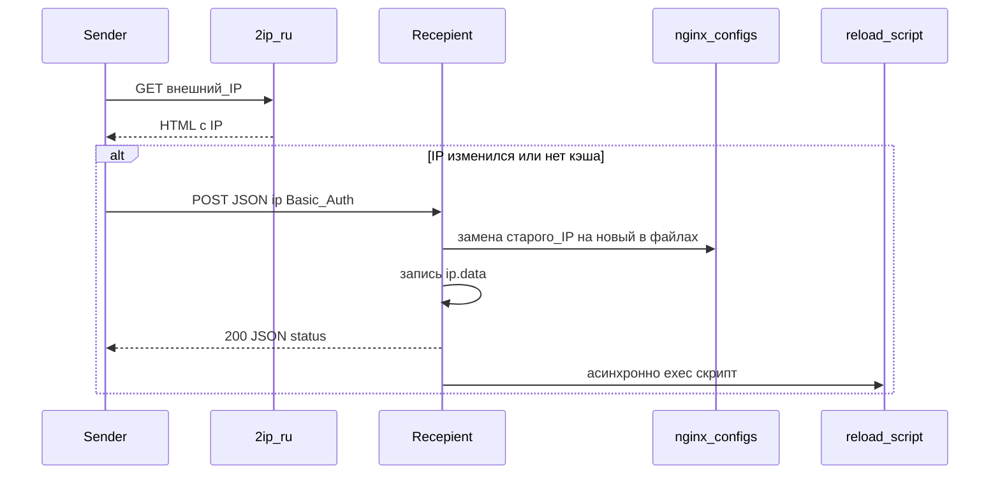

# swapip

Утилиты для **динамического DNS на минималках**: когда у клиента меняется внешний IP, на сервере с nginx автоматически подставляется новый адрес в конфиги и перезапускается веб-сервер.

## Назначение сервисов

| Компонент | Бинарник | Роль |
|-----------|----------|------|
| **Sender** | `cmd/sender` | Запускается там, где «плавает» IP (домашний ПК, роутер с cron и т.д.). Узнаёт текущий внешний IPv4 через сервис [2ip.ru](https://2ip.ru), сравнивает с последним сохранённым значением в локальном файле. Если IP изменился — отправляет его на удалённый HTTP-эндпоинт получателя. |
| **Recepient** | `cmd/recepient` | Работает на сервере с nginx. Поднимает защищённый Basic Auth HTTP-сервер, принимает POST с новым IP, **подменяет старый IP на новый** в указанных файлах конфигурации nginx, сохраняет IP в файл и **запускает скрипт** (обычно перезагрузка nginx). |

Имя каталога `recepient` — историческая опечатка от слова *recipient* (получатель).

## Взаимодействие



На стороне **Sender** локальный файл (`STORAGE_IP`, по умолчанию `ip.data`) хранит последний успешно отправленный IP — лишние запросы к получателю не делаются.

На стороне **Recepient** файл с тем же смыслом нужен для **подстановки в конфигах**: при следующем обновлении старый IP читается из хранилища и заменяется на пришедший новый.

## Сборка

Из корня репозитория:

```bash
go build -o build/sender ./cmd/sender
go build -o build/recepient ./cmd/recepient
```

Либо цели в [Makefile](Makefile): `make build-w` (Windows 386), `make build-l` (linux/amd64).

## Конфигурация

Переменные задаются в окружении; при наличии файла `.env` он подхватывается автоматически.

### Общие (оба бинарника)

| Переменная | Описание |
|------------|----------|
| `LOG_LEVEL` | Уровень логирования zap (например `info`, `debug`, `error`). |
| `LOG_PATH` | Если задан — логи пишутся в каталог (файл `log.log` внутри него); иначе вывод в консоль по настройкам логгера. |
| `HTTP_CLIENT_TIMEOUT` | Таймаут исходящих HTTP (sender: 2ip.ru и POST к получателю). По умолчанию `30s`. |

### Sender

| Переменная | Описание |
|------------|----------|
| `SENDER_REMOTE_ADDRESS` | Полный URL получателя, например `http://example.com:8080/`. |
| `SENDER_BASIC_AUTH` | Заголовок в формате Basic: строка после префикса `Basic ` (как в `Authorization`). |
| `STORAGE_IP` | Путь к локальному файлу с последним отправленным IP. По умолчанию `ip.data`. |

### Recepient

| Переменная | Описание |
|------------|----------|
| `RECEPIENT_ADDRESS` | Адрес прослушивания HTTP-сервера. По умолчанию `:8080`. |
| `RECEPIENT_NGINX_CONF` | Путь к **текстовому файлу-списку** путей к конфигам nginx (см. ниже). |
| `RECEPIENT_SCRIPT` | Команда или путь к скрипту перезапуска nginx (на Windows — через `cmd /C`, на Unix — через `/bin/sh`). |
| `RECEPIENT_USER_DATA` | Файл с учётными данными Basic Auth: по строке на пользователя, строка — Base64 от `user:password`. По умолчанию `./user.data`. |
| `STORAGE_IP` | Файл с текущим IP на сервере (для замены в конфигах). По умолчанию `ip.data`. |

Значение `SENDER_BASIC_AUTH` на клиенте и записи в `RECEPIENT_USER_DATA` на сервере должны соответствовать друг другу.

## Формат файла списка конфигураций nginx

Файл, путь к которому задан в `RECEPIENT_NGINX_CONF`, содержит абсолютные пути к файлам nginx — **по одному на строку**. Пустые строки и строки, начинающиеся с `#`, игнорируются.

Пример:

```
/etc/nginx/nginx.conf
/etc/nginx/sites-enabled/default
# /etc/nginx/extra.conf
```

В этих файлах IP должен встречаться **как отдельное значение** (как сохранено в `STORAGE_IP`), чтобы сработала текстовая замена.

## Эксплуатация

- Запускайте **recepient** на сервере как долгоживущий процесс (или под systemd/supervisor).
- Запускайте **sender** по расписанию (cron, планировщик задач) или в цикле — как удобно для проверки смены IP.
- Рекомендуется оборачивать HTTP получателя в **TLS** и/или ограничивать доступ на уровне сети (firewall, VPN); в самом приложении только Basic Auth.
